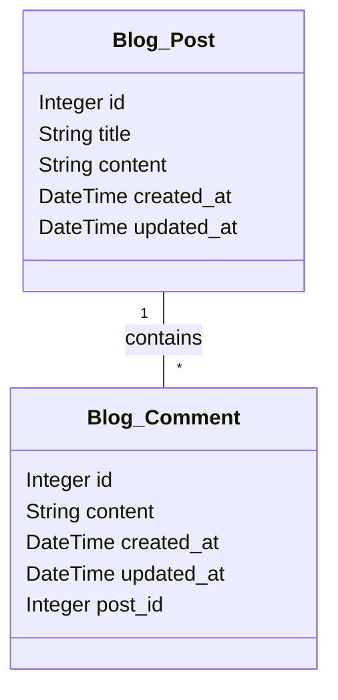

# Django Blog Post Model

이 글에서는 Django를 사용하여 블로그 애플리케이션을 만들 때 사용할 수 있는 블로그 포스트 모델에 대해 알아보겠습니다.

저런 느낌으로 위에다 달면 자동화가 됩니다.

```python
# blog > models.py

from django.db import models

class Post(models.Model):
    title = models.CharField(max_length=200)
    content = models.TextField()
    created_at = models.DateTimeField(auto_now_add=True)
    updated_at = models.DateTimeField(auto_now=True)

    def __str__(self):
        return self.title

class Comment(models.Model):
    post = models.ForeignKey(Post, on_delete=models.CASCADE, related_name='comments')
    content = models.TextField()
    created_at = models.DateTimeField(auto_now_add=True)
    updated_at = models.DateTimeField(auto_now=True)

    def __str__(self):
        return f'Comment by {self.id} on {self.post}'

```

```python
# blog > models2.py

from django.db import models


class Comment(models.Model):
    post = models.ForeignKey(Post, on_delete=models.CASCADE, related_name='comments')
    content = models.TextField()
    created_at = models.DateTimeField(auto_now_add=True)
    updated_at = models.DateTimeField(auto_now=True)

    def __str__(self):
        return f'Comment by {self.id} on {self.post}'

```



```viz
digraph AppSchema {
  rankdir=LR; // 노드들을 가로로 배치
  node [shape=plaintext]; // 노드 스타일을 plaintext로 설정

  // 앱 'Blog'를 위한 서브그래프
  subgraph cluster_Blog {
    label="Blog";
    color=blue;
    style=dashed;

    // 'Blog' 앱의 테이블 정의 (HTML-like 레코드 형식)
    Post [label=<<table border="0" cellborder="1" cellspacing="0">
                <tr><td port="title" bgcolor="lightgrey"><b>Post</b></td></tr>
                <tr><td port="id_fld">🔐 id</td></tr>
                <tr><td>title</td></tr>
                <tr><td>content</td></tr>
                <tr><td port="author_id_fld">🔑 author_id (FK)</td></tr>
                <tr><td>created_at</td></tr>
                <tr><td>updated_at</td></tr>
               </table>>];
    Comment [label=<<table border="0" cellborder="1" cellspacing="0">
                <tr><td port="content" bgcolor="lightgrey"><b>Comment</b></td></tr>
                <tr><td>id</td></tr>
                <tr><td>content</td></tr>
                <tr><td>created_at</td></tr>
                <tr><td>updated_at</td></tr>
                <tr><td port="post_id_fld">🔑 post_id (FK)</td></tr>
               </table>>];
  }

  // 앱 'Accounts'를 위한 서브그래프
  subgraph cluster_Accounts {
    label="Accounts";
    color=red;
    style=dashed;

    // 'Accounts' 앱의 테이블 정의 (HTML-like 레코드 형식)
    CustomUser [label=<<table border="0" cellborder="1" cellspacing="0">
                    <tr><td port="username" bgcolor="lightgrey"><b>CustomUser</b></td></tr>
                    <tr><td port="id_fld">🔐 id</td></tr>
                    <tr><td>username</td></tr>
                    <tr><td>email</td></tr>
                    <tr><td>is_active</td></tr>
                    <tr><td>created_at</td></tr>
                    <tr><td>updated_at</td></tr>
                   </table>>];
  }

  // 외래 키 관계의 화살표 스타일 설정
  edge [color=blue, fontcolor=black, dir=none]; // dir=none으로 화살표 없앰

  Comment:post_id_fld -> Post:id_fld [arrowhead="none", arrowtail="crow", dir="both"];
  Post:author_id_fld -> CustomUser:id_fld [arrowhead="none", arrowtail="crow", dir="both"];

}


```
